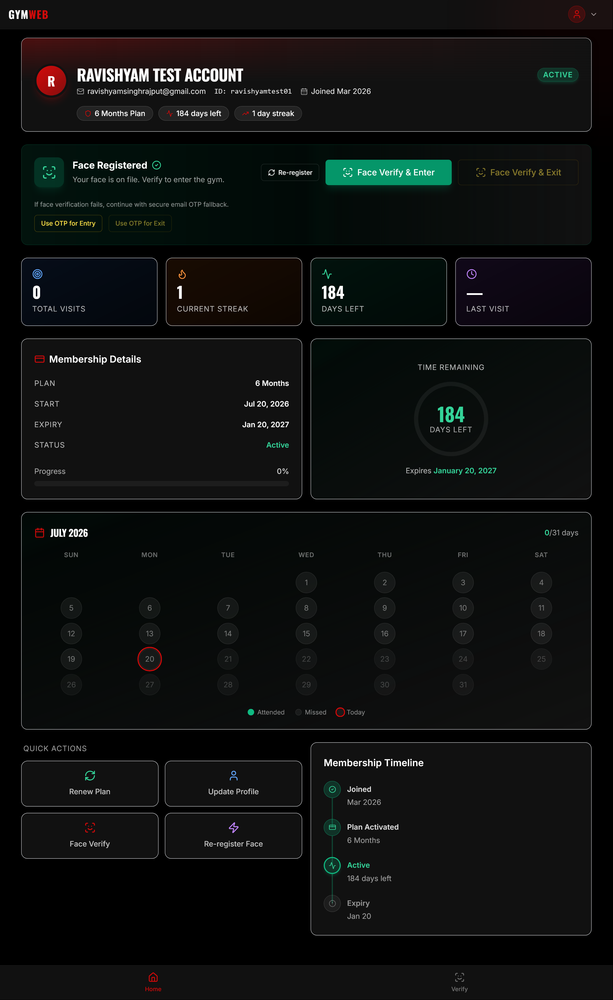
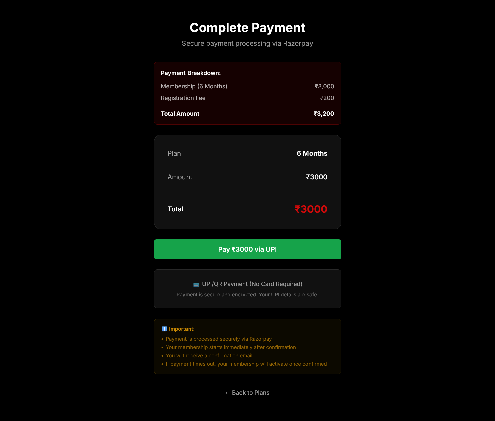
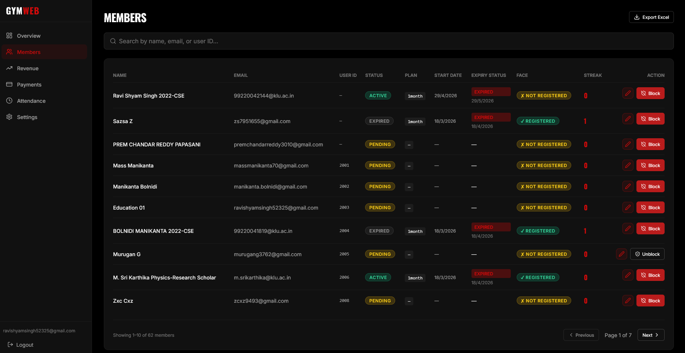

# Om Muruga Olympia Fitness

## About

Om Muruga Olympia Fitness is a modern fitness management platform built for members and administrators. It brings together a public landing experience, secure face verification, daily attendance tracking, membership management, Razorpay payment integration, and an admin control panel for day-to-day operations.

## Landing Page

The landing page introduces the gym, presents the brand professionally, and guides visitors toward registration, login, and membership onboarding.


## User Dashboard

The user dashboard is where members manage their experience after login. It shows their profile, membership status, attendance activity, daily streaks, payment-related details, and access to face verification and profile completion flows.



## Payment Integration

The payment integration page explains how Razorpay is used to process membership payments securely inside the platform. It supports membership checkout, payment confirmation, and a smooth onboarding flow for paid plans.



## Admin Dashboard

The admin dashboard is designed for gym staff and management. It supports user administration, membership updates, payment oversight, attendance review, and operational monitoring from one central panel.



## Key Highlights

- 1 public landing page for gym branding and onboarding
- 1 user dashboard for daily tracking, membership status, and streaks
- 1 payment integration flow powered by Razorpay
- 1 admin dashboard for user and membership management
- Face registration and face verification for secure access
- Attendance tracking, OTP fallback, and profile completion support

## Image File Names

Place the image files in `docs/screenshots/` using these names:

- `landing-page.png`
- `payment-integration.png`
- `user-dashboard.png`
- `admin-dashboard.png`

If you prefer JPG, keep the same base names and change only the extension.

## Tech Stack

### Frontend
- React 19
- Vite
- React Router
- Framer Motion
- Tailwind CSS
- face-api.js

### Backend
- Node.js
- Express
- MongoDB / Mongoose
- Firebase Admin
- Razorpay
- Nodemailer

## Getting Started

### Prerequisites
- Node.js v22+
- MongoDB Atlas account or local MongoDB instance
- Firebase project with Authentication enabled
- Razorpay account for payment integration

### Install Dependencies

```bash
cd client
npm install

cd ../server
npm install
```

### Local Development

Start the backend:

```bash
cd server
npm run dev
```

Start the frontend:

```bash
cd client
npm run dev
```

Open the app at `http://localhost:5173`.

## Environment Files

Keep sensitive values out of version control. Use these local environment files:

- `client/.env.local`
- `server/.env.local`
- `client/.env.production`
- `server/.env.production`

Common values include API URLs, Firebase credentials, Razorpay keys, and MongoDB connection strings.

## Project Structure

```text
.
├── client/
│   ├── src/
│   │   ├── pages/
│   │   │   ├── LandingPage.jsx
│   │   │   ├── UserDashboard.jsx
│   │   │   ├── VerifyFace.jsx
│   │   │   └── admin/
│   │   └── components/
│   │       └── layout/
│   │           ├── UserLayout.jsx
│   │           └── AdminLayout.jsx
│   └── public/
├── server/
│   ├── controllers/
│   ├── models/
│   ├── routes/
│   └── utils/
└── docs/
    └── screenshots/
        ├── landing-page.png
        ├── payment-integration.png
        ├── user-dashboard.png
        └── admin-dashboard.png
```

## Deployment Notes

- Frontend hosting: Netlify
- Backend hosting: Render or Railway
- Database: MongoDB Atlas
- Payments: Razorpay

## Security Notes

- Do not commit `.env` files
- Do not commit Firebase service account JSON files
- Keep API secrets and payment keys in environment variables only

## Author

**Ravi Shyam Singh**  
[LinkedIn](https://www.linkedin.com/in/ravi-shyam-singh-790273367/) | [GitHub](https://github.com/Ravishyamsingh/leaveflow)

## License

This project is licensed under the MIT License.
